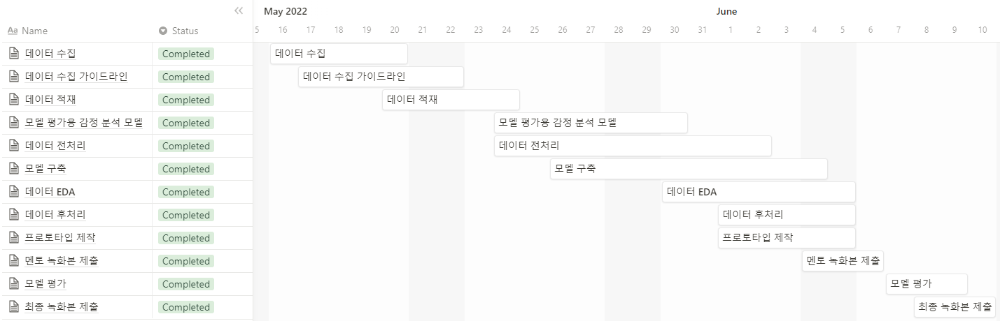
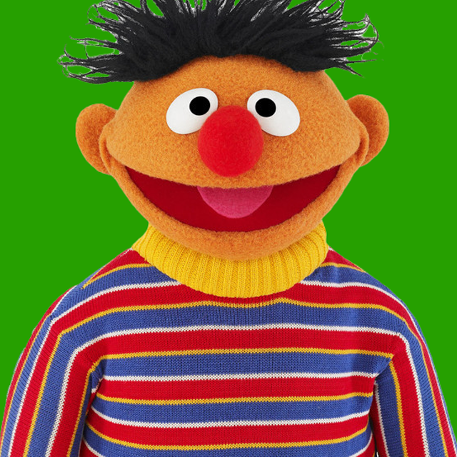
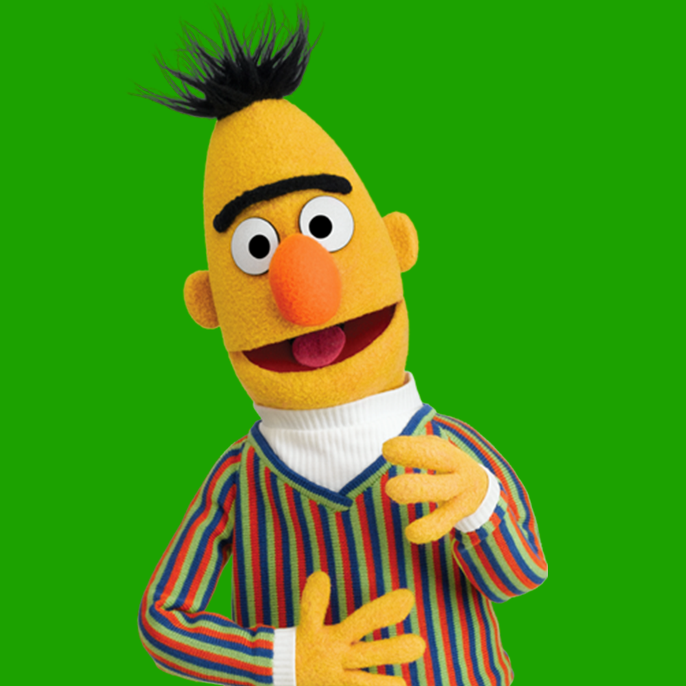
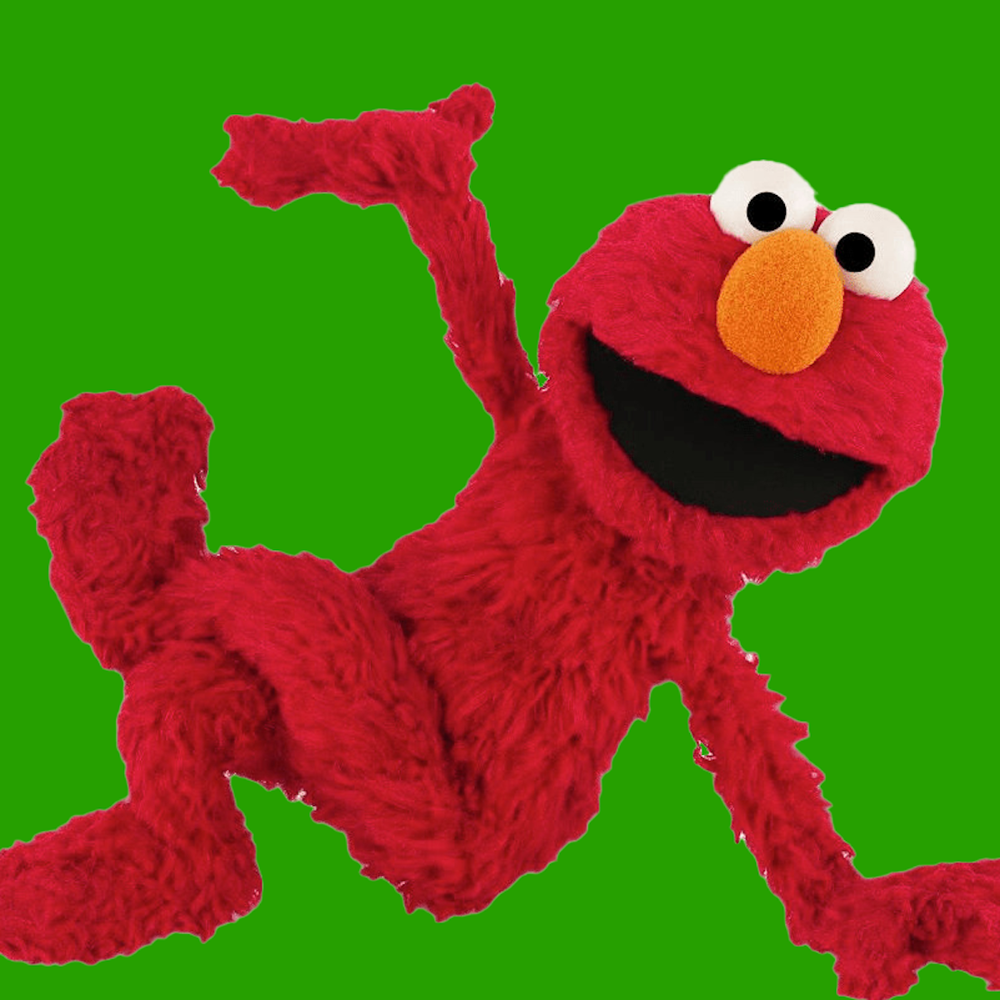
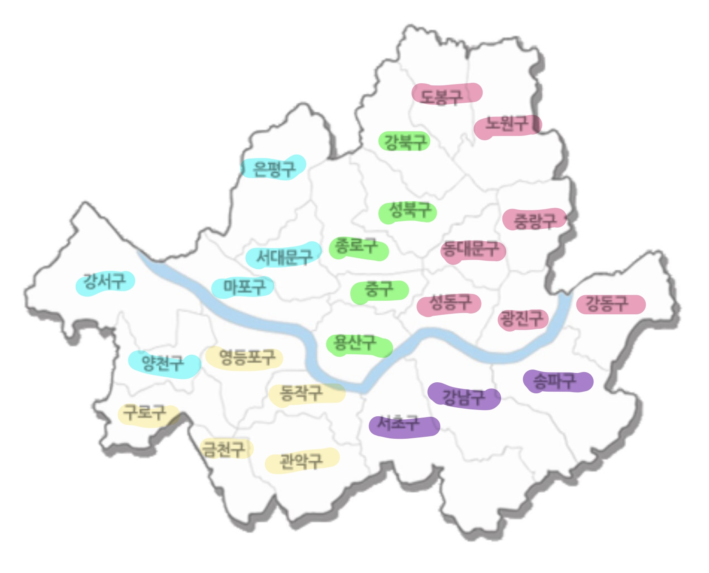
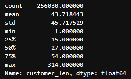
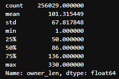
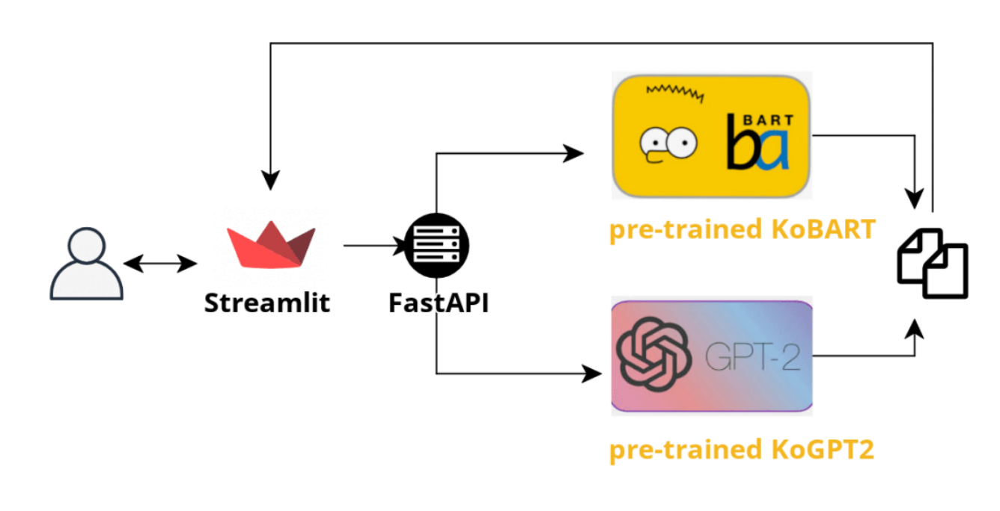

# 최종 프로젝트 랩업리포트

# 1. 프로젝트 개요

## 문제 정의

- 문제: 배달앱의 고객 리뷰에는 사장님이 답글을 달 수 있는 기능이 있으나, 모든 업장 사장님이 이 기능을 쓰진 않음
- 원인: 모든 리뷰에 사장님이 일일이 장문의 답글을 타이핑 하기엔 작업 시간이 많이 들기 때문에 기피하는 경향이 있음
- 해결책: 주어진 고객 리뷰에 대응하는 적절한 답변을 자동 완성하여 제시하면, 작업 시간이 줄어들 것이며, 사장님들이 좀 더 자신있게 답글을 달 수 있도록 도와줄 수 있을 것이다.

## 개발 목표

- 한국어 생성 모델을 활용하여 배달앱 고객 리뷰에 대응하는 사장님 답글을 생성하여 제안하는 서비스 만들기.
- 부스트캠프 기간 동안 학습했던 데이터 수집, 모델링, 서빙을 모두 체험해볼 수 있는 프로젝트를 경험해보기.
- 실제 비지니스에서 사용되는 데이터를 직접 수집하고 사용하면서 실무와 가까운 프로젝트를 경험해보기.

# 2. 프로젝트 팀 구성 및 역할

- 타임라인

- 팀원 소개 및 역할

|                                                  [김준재](https://github.com/junejae)                                                   |                                                                          [김현아](https://github.com/HyunAh-Kim-Clou)                                                                           |                                                 [배현진](https://github.com/hyunbool)                                                  |                                                                        [이강민](https://github.com/Lkangmin)                                                                         |                                                                         [최성원](https://github.com/matchiii)                                                                         |
| :-------------------------------------------------------------------------------------------------------: | :-------------------------------------------------------------------------------------------------------------------------------------------------------: | :-----------------------------------------------------------------------------------------------------: | :---------------------------------------------------------------------------------------------------------------------------------------------------: | :----------------------------------------------------------------------------------------------------------------------------------------------------: |
|  |  |  |  |  |
|KoBART finetuning, 리펙토링, KcELECTRA 텍스트 감정분석 모델 활용|데이터 전/후처리, 텍스트 유사도 분석, 프로토타입 제작|데이터 크롤링, 모델링(GPT2)|크롤링 코드 작성, 데이터 EDA, 텍스트 유사도 분석(glove, SBERT)|데이터 크롤링 수행, 데이터 EDA, 프로토타입 제작(streamlit)|

# 3. 프로젝트 수행 절차 및 방법

## 데이터셋

### 크롤링

- Selenium을 이용하여 요기요 웹페이지를 크롤링
- 서울 전체 지하철역 주소 기준으로 크롤링
    
    
    
- 모든 업종의 리뷰 데이터를 수집하기엔 너무 방대하였기에, 요기요의 모든 업종 중에 ‘카페/디저트’ 부분만 크롤링
- 사장님 답글이 있는 리뷰만 크롤링

### EDA

- 고객 리뷰 + 사장 답글 (약 25만 데이터)
- 길이 분포
    - 고객 리뷰
        
        
        
        
        
    - 사장 답글
        
        
        
        
        
    - 길이 분포의 통계를 바탕으로 고객 리뷰와 사장 답글이 적절한 길이인 경우만 사용
        - 고객 리뷰: 15 초과, 100 미만
        - 사장 답글: 50 초과, 200 미만

### 전처리

- 유사도
    - 기반 아이디어
        - 단순히 사장님 답글을 학습하는 것이 아닌 고객 리뷰에 맞춰 생성하는 것을 목표로 하였다. 따라서, 고객 리뷰와 사장님 답글간의 유사도가 필요했다.
    - Glove
        - 한국어 위키백과, KorQuAD, 네이버 영화 말뭉치 등으로 학습된 glove를 사용
            
            
            
            
            
        - glove의 경우 명사를 추출하고 유사도를 측정하기 때문에 0이 대략 3만개 발생
    - Sentence-BERT
        - SBERT의 finetuning 방식인 STS(Semantic Textual Similarity) 문제는 두 문장으로부터 의미적 유사성을 구한다. 해당 방식이 우리가 생각하는 유사도와 비슷하다고 생각하여 사용
        - multi-lingual SBERT 중 가장 성능이 좋은 paraphrase-multilingual-MiniLM-L12-v2 를 사용
            
            
            
            
            
        - 최종 유사도 분포를 이용하여 glove는 0을 제외한 분포에서 0.4 이상, Sentence-BERT는 전체 분포에서 0.4 이상의 값을 보이는 데이터만 남도록 전처리

- 감정분석
    - 가설: “고객 리뷰 글과 사장 답글 사이에는 모종의 유사성이 존재할 것이며, 이러한 유사한 패턴 중 검출 가능한 것 중 하나가 감정일 것이다.”
    - 감정분석 모델의 훈련용으로 서울대 KOTE 데이터셋을 이용([https://github.com/searle-j/KOTE](https://github.com/searle-j/KOTE))
        - KOTE 데이터셋은 인터넷 댓글을 기반으로 하기 때문에, 문장의 분위기가 배달 앱 리뷰와 유사할 것이라 판단
        - KOTE로 사전학습 된 모델(KcElectra)을 사용
    - 정해진 threshold(0.4) 이상의 확률을 가지는 감정 라벨에 대해 각 문장 쌍의 감정 유사성을 판단.
        - 실험 결과, 하나 이상의 공통적인 감정라벨을 가지는 경우가 약 95% 가량 있는 것으로 확인.
    - 추후 활용하고자 감정 라벨을 데이터셋에 추가
- 개인정보 마스킹
    - 고객이름 마스킹(aa**님, aa**고객님, aa** 님, Aa**님, AA**님)
    - 상호명 마스킹 (상호명-ㅇㅇ점, 상호명 ㅇㅇ점, 상호명)
    - 위치 & 기관 마스킹 (00점, 00재단)
    - 전화번호 마스킹
        - 전화번호(ex. 010-11일1-1111), 인스타 계정 (@인스타계정)
        - 이메일, 홈페이지

## 모델

### KoGPT-2

- 모델 소개
    - transformer의 디코더로 구성된 모델
    - 각 토큰을 순차적으로 예측하고, 이전에 예측된 토큰을 다음 단계의 입력으로 사용하는 Auto-Regressive 모델
- finetuning
    - 손님의 리뷰를 보고, 모델은 그 리뷰에 대응하는 답글을 생성해주어야 하기때문에 손님 리뷰와 사장님 답글을 함께 합쳐서 입력
    - 입력 구조
        - input: 손님리뷰 <review> 사장님답글 / target: 사장님답글
    - implementation
        - SKT/KoGPT2([https://github.com/SKT-AI/KoGPT2](https://github.com/SKT-AI/KoGPT2))를 이용
        - max length 300(손님답글 200 + 사장답글 100)
        - batch = 16, lr = 3e-5, weight decay = 0.001

### KoBART

- 모델 소개
    - Transformer의 Encoder와 Decoder 구조를 모두 가진 LM
    - 고객 리뷰 글 만을 input으로 넣어 encoding 된 데이터를 기반으로 decoder가 알맞은 답글을 생성 할 수 있을 것이라 생각하여 채택
- finetuning
    - 입력 구조
        - input: 별점 + 손님 리뷰 / target: 사장님 답글
    - implementation
        - KoBART(https://github.com/SKT-AI/KoBART)를 이용
        - Max Length: Input(256), Target(128)
        - batch = 32, lr = 3e-5, weight decay = 0.001

## Product Serving

- Train
    - Huggingface
    - PyTorch Lightning
- Inference & Generation
    - Greedy
    - Sampling
    - Beam-search
- Demo
    - Streamlit
    - FastAPI
- 모델링 아키텍처
    - 셀레니움으로 크롤링하여 수집한 데이터를 각종 EDA를 통해 정제
    - BART와 GPT-2 학습
    - 결과를 분석해 데이터셋의 미흡한 점을 개선하여 다시 학습시켜 결과를 얻는 사이클

- 전체 서비스 아키텍처
    
    
    

# 4. 프로젝트 수행 결과

## 시연

## 결과

- ROUGE
    - 다양한 Text Generation task에 있어 가장 많이 사용되는 metric 중 하나
    - ROUGE-L: LCS를 사용해 단어의 longest matching sequence를 계산
    
    | 모델 + 토큰 생성 방식 | rouge-l(f) |
    | --- | --- |
    | KoBART - samling | 0.000006449 |
    | KoBART - beam | 0.000010963 |
    | KoGPT2 - sampling | 0.000012017 |
    | KoGPT2 - beam | 0.000009345 |
    - ROUGE의 경우, 같은 단어를 사용하는 경우에 점수가 높게 나오게 된다. 하지만 우리 서비스에서는 정해진 답이 있는 것이 아니라 고객 리뷰 데이터에 대해 단어가 달라도 연관성이 높고 응집력 있는 사장 답글을 만들어 내는 것이 목표
        - 따라서 기존에 텍스트 생성 task에서 가장 많이 사용되던 ROUGE 점수를 대체할 수 있는 metric을 고안, automatic metric으로는 감정분석과 유사도 분석, human evaluation으로는 두가지 기준을 두어 평가를 진행
- 유사도 분석
    - 데이터 전처리에 활용하던 glove와 Sentence BERT를 활용하여 모델 성능 측정
    
    | 모델 + 토큰 생성 방식 | Glove |
    | --- | --- |
    | KoBART - samling | 0.7008 |
    | KoBART - beam | 0.6973 |
    | KoGPT2 - sampling | 0.6469 |
    | KoGPT2 - beam | 0.6441 |
    | 원본(고객 - 사장) | 0.6839 |
    
    | 모델 + 토큰 생성 방식 | SBERT |
    | --- | --- |
    | KoBART - samling | 0.5954 |
    | KoBART - beam | 0.5610 |
    | KoGPT2 - sampling | 0.5693 |
    | KoGPT2 - beam | 0.5926 |
    | 원본(고객 - 사장) | 0.6311 |
    - 학습 데이터셋이 0.4 이상인 경우만 뽑아 활용하였는데, 모델들이 생성한 답글도 어느정도 수준 이상의 유사도를 보임
- 감정 분석
    - 감정 유사도를 계산하는 정량적 방법
        - emotion_score(공감 수치) = (customer & manager) / (customer | manager)
    
    | 모델 + 토큰 생성 방식 | 공감수치 |
    | --- | --- |
    | KoBART - samling | 0.6250 |
    | KoBART - beam | 0.6256 |
    | KoGPT2 - sampling | 0.6148 |
    | KoGPT2 - beam | 0.6225 |
    | 원본(고객 - 사장) | 0.6433 |
- 사용자 평가
    - 두가지 기준에 대해 사용자 평가 진행 (5인)
        - 유창성: 문법이나 사용되는 단어가 적절한지
        - 연관성: 고객리뷰와 생성된 사장 답글이 내용상 얼마나 연관되어 있는지
    - 각 모델별로 100개의 고객 답글에 대해 예측한 답글로 평가
    - 의견의 일치도를 평가하기 위해 Fleiss Kappa와 단순 hard-voting을 통해 결과를 도출
        - Generation Task이기 때문에 사람마다 유창성과 연관성의 척도가 다르며, 그렇기 때문에 fleiss-kappa의 경우 점수가 매우 낮게 나옴
        - Hard-Voting을 통한 유창성과 연관성의 경우 beam search를 통해 토큰을 생성한 경우 가장 점수가 높았음

| 모델 + 토큰 생성 방식 | 유창성 | 연관성 |
| --- | --- | --- |
| KoBART - sampling | 0.12 | 0.018 |
| KoBART - beam | -0.033 | 0.164 |
| KoGPT2 - sampling | 0.393 | 0.078 |
| KoGPT2 - beam | -0.063 | -0.042 |

<Fleiss-Kappa>

| 모델 + 토큰 생성 방식 | 유창성 | 연관성 |
| --- | --- | --- |
| KoBART - sampling | 53 | 49 |
| KoBART - beam | 84 | 64 |
| KoGPT2 - sampling | 80 | 63 |
| KoGPT2 - beam | 98 | 66 |

<Hard-Voting>

# 5. 자체 평가 의견

## 문제점

- Generation 시간이 오래 걸림
    - 한 리뷰 당 답글 생성까지 3~5초가 소요되기 때문에, 실시간 서비스에 다소 무리가 있어보임
- 컴플레인 대응
    - 리뷰는 부정적이지만 사장답글은 이를 고려하지 못하는 경우가 발생
        - ex) 고객 리뷰: 양추가해도 너무적어요. ㅜㅜ 야채도적어요 ㅜㅜ 맛은괜찮는데조금짜요 배달은너무느려요 ㅋㅋㅋ 흠..,
            - 예측 답글: 저는 정말맛있게드셔주시니감사드려용^^ 더 노력하는 #@상호명# 되겠습니다
- 답글 퀄리티
    - 상관이 없는 메뉴를 언급하는 경우
        - ex) 고객 리뷰: 마시멜로 도넛은 생각보다 그냥 그러네요~ 소금우유 도넛은 빵이 쫄깃쫄깃 해서 맛있게 잘먹었습니다.
            - 예측 답글: 역시 디저트하면 잠봉뵈르죠:D
    - 어투나 사용하는 단어가 서비스에 적합하지 않는 경우
        - ex) 고객 리뷰: 25일 주문인데.. 유통기한임25일인건 좀 심한듯해요.. 직접고르면 이건 고르지 않았을듯요..
            - 예측 답글: 저희는 매장도 친절하세요~~^^ ;; 다른 제품에도 잘 어울려서 고객님이 선택하신겁니다. 맛있게 드셔주셔서 감사합니다. 건강히 살펴용😁
    - 사실 관계 여부를 알 수 없는 경우(시간, 계절, 사진 포함 유무)
        - ex) 고객 리뷰: 배달도 빠르고 쉐이크도 맛있어요. 포방도 잘되있어서 세지 않았네요
            - 예측 답글: 저희를 믿고 주문해주셔서 너무 감사합니다~^^ 맛있게 잘 드셨길 바래요. 오늘 하루도 따스한 봄날 되시길 바랍니다. 진심으로 감사드립니다.

## 시도했으나 안 됐던 것

- KoGPT-2 to huggingface
    - 기존에 가지고 있던 huggingface를 사용한 베이스라인을 사용해 KoGPT2 Review Generation 코드를 작성했으나 학습 속도가 매우 느려 실험을 진행하기에 부적절했음
        - 빠른 시간 내에 결과를 내야했기 때문에 코드를 작성은 했지만 사용하지 못했던 부분이 아쉬움
        - 코드를 정리하며 어떤 부분 때문에 속도가 느려진 것인지 살펴 볼 예정
- NER로 위치 & 기관 Entity 마스킹
    - Pororo 라이브러리의 NER로 위치 및 기관 Entity 마스킹 처리를 하려고 했으나, 1분에 10개 NER을 수행하는 데 총 데이터 양이 20만개라 처리속도가 너무 느려 진행하기 부적절
        - 처리 결과 일부를 확인 및 참고하여 마스킹
- 유사도로 TF-IDF 사용
    - TF-IDF로 고객 리뷰와 사장 답글의 유사도를 분석하려고 했으나 해당 문장간의 TF-IDF 값이 0인 값이 너무 많아 사용하지 못함

## 시도해볼 점

- Inference 시간이 오래 걸리는 문제 해결
    - 모델 경량화 고려
    - 입력으로 들어오면 미리 DB에 저장
    - 모델은 서버에서 준비가 완료되어 있고, 사장님에게 입력만 받아서 API로 통신하는 방식
- 컴플레인 대응 강화
    - 별점을 이용, 부정적인 리뷰 데이터셋을 따로 분할해 부정 리뷰에 대한 모델을 새로 학습
- 리뷰 퀄리티 개선
    - 주문 메뉴, 리뷰 감정, 사진유무 등 리뷰를 작성하는데 필요한 정보를 Input에 추가
    - Prefix로 ‘사장 답글 생성해 줘' 와 같이 모델에 정확한 명령을 줘보기
- 평가 Metric 고안, 개선
    - 유창성 관련 Metric 필요
        - 유사도 평가, 감정분석 모두 연관성과 관련된 Metric
    - 사용자 평가
        - 다양한 사람들의 의견이 필요
        - 현재는 유창성과 연관성 밖에 없지만, 정확한 비교를 위해서는 다양한 평가 지표가 필요

